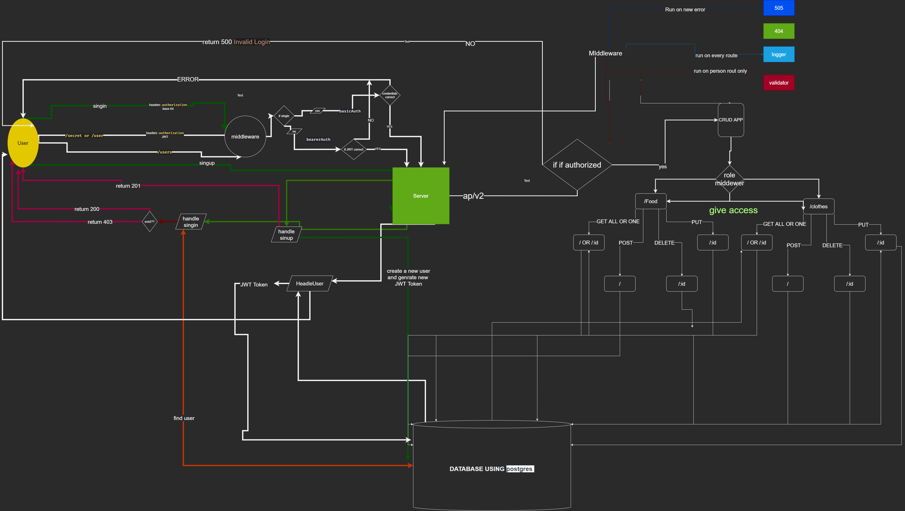

# auth-api

Auth Rules Api juicy ✍️(◔◡◔)

## Links

- heroku: [jallad-basic-express-server](https://jallad-auth-api.herokuapp.com/)
- github repo: [basic-express-server](https://github.com/Ahmadjlallad/auth-api)
- latest PR: [PR](https://github.com/Ahmadjlallad/auth-api/pull/1)
- Github actions: [actions](https://github.com/Ahmadjlallad/auth-api/actions)

## express with basic routes and unit testing

---

## progress

- [x] connect two started servers
- [x] create a v2 route
- [x] test it manually
- [x] create a test for it

---

## Documentation

UML Reference


---

## JSDoc

```js
/**
 *
 * @param {string} capability
 * @description  check if user has capability to access the resource or not
 * @returns a middleware function that checks if the user has the capability to access the route
 */
module.exports = (capability) => {
  return (req, res, next) => {
    try {
      if (req.user.capabilities.includes(capability)) {
        next();
      } else {
        next("Access Denied");
      }
    } catch (e) {
      next("Invalid Login");
    }
  };
};
```
